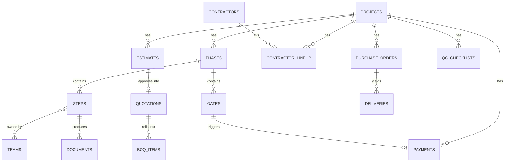

# RIPPOTAI Workflow Engine — Technical System Architecture

**Source:** RIPPOTAI Master Process Brain (consolidated from 4 source documents: Project Workflow, Process Flowchart, Phase × Document Matrix, How We Work)
**Target:** A buildable module inside INOS — reusable for any architecture/interior firm, seeded with Rippotai's own process as the default template.

---

## 0. The one idea this whole document is built on

The Master Process Brain is not a checklist — it's a **graph**: Phases contain Steps, some Steps are hard-blocking Gates, two Tracks (Vendor & Trades, Material & Procurement) run in parallel and only touch the main spine at specific Gate events. If you build this as fixed screens per phase, every future firm (and every future change to Rippotai's own process) means new code. Build it as **one workflow engine that executes a config**, and the Master Process Brain becomes the seed data, not the spec.

That's the difference this document is optimizing for everywhere below.

---

## 1. System at a glance

| Metric | Count |
|---|---|
| Sequential phases | 9 (Brief → Snag & Handover) |
| Parallel tracks | 2 (Vendor & Trades · Material & Procurement) |
| Teams | 19 (7 core + 12 contractor trades) |
| Hard gates (blocking sign-offs) | 12 |
| Steps | ~90 |
| Document types produced | ~70 |

The horizontal position of anything in the source chart is **order of work, not a date** — that's true of your reference chart and it must stay true in the database. Don't store the chart's `a`/`b` numbers as literal dates anywhere. They're a sequencing hint for the UI, not a scheduling primitive — see §5.3.

---

## 2. Domain model — the entities you're actually building

| Entity | What it is | Source concept |
|---|---|---|
| `Organization` | A firm using the system (Rippotai is tenant #1) | — |
| `WorkflowTemplate` | The reusable phase/step/gate graph, versioned, owned by an org | The whole Master Process Brain |
| `Project` | One client engagement, instantiated from a template | — |
| `Phase` | A named stage (`BRIEF`, `DESIGN`, `EXECUTION`...) | `GROUPS[n]` |
| `Track` | A parallel phase group not on the main spine | `GROUPS['A']`, `GROUPS['B']` (parallel: true) |
| `Step` | One unit of work inside a phase, owned by 1+ teams | `rows[]` |
| `Gate` | A blocking checkpoint — nothing downstream starts until signed off | `rows[].gate === true` |
| `Team` | A role or trade — core (7) or contractor (12) | `TEAMS{}` |
| `Document` | A file/record produced by a step | `rows[].d[]` |
| `Estimate` | A priced draft — trade or material — pre-approval | Path A/B, §8 |
| `Quotation` | An estimate after approval — immutable, contractual | "the one rule" |
| `BOQ` | Bill of quantities, consolidated from approved quotations + GFC drawings | `A.7` |
| `PurchaseOrder` | A material buy against an approved material quotation | `B.5` |
| `QCChecklist` | Site Supervisor's per-phase sign-off before the next trade starts | `08` continuous rows |
| `SiteVisit` | Scheduled or ad-hoc visit, any team | `8.1` |
| `PaymentMilestone` | Token, Payment Phase 01, final — tied to specific gates | `04`, `5.5` |

---

## 3. Data model

Core tables — this is close to DDL-ready. `org_id` on every top-level table for multi-tenancy (row-level scoping, not separate schemas — simpler ops at your scale).

```sql
-- Tenancy & templates -------------------------------------------------
organizations(id, name, created_at)

teams(
  id, org_id, code text,            -- 'ARC', 'ADM', 'CIV'...
  name text, category text,          -- 'core' | 'contractor'
  color text, is_default boolean     -- seeded from Rippotai's 19
)

workflow_templates(
  id, org_id, name, version int,
  config jsonb,                      -- the whole phase/step/gate graph — see §5.2
  is_active boolean
)

-- Projects --------------------------------------------------------------
projects(
  id, org_id, client_name, template_id, template_version,
  status text,                       -- 'active' | 'on_hold' | 'closed'
  created_at
)

phases(
  id, project_id, code text,         -- '01'..'09', 'A', 'B'
  title, sequence int, is_parallel boolean,
  lead_team_id, status text          -- 'not_started' | 'active' | 'complete'
)

steps(
  id, phase_id, step_no text, title, description,
  status text,                       -- 'pending' | 'in_progress' | 'done'
  is_continuous boolean,             -- runs alongside, no fixed end (r.cont)
  sort_order int
)

step_teams(step_id, team_id)         -- many-to-many, r.tm[]

gates(
  id, project_id, phase_id, code, label,
  trigger_description, between_teams,
  status text,                       -- 'pending' | 'signed_off'
  signed_off_by, signed_off_at
)

-- Documents ---------------------------------------------------------------
documents(
  id, project_id, phase_id, step_id, gate_id,
  doc_type text, title, file_url, version int,
  status text,                       -- 'draft' | 'final' | 'superseded'
  uploaded_by, uploaded_at
)

-- Commercial: the estimate -> quotation rule (applies to BOTH tracks) -----
estimates(
  id, project_id, track text,        -- 'trade' | 'material'
  ref_id uuid,                       -- contractor_id or material_item_id
  path text,                         -- 'rates_only' | 'vendor_quote' (trade only)
  amount numeric, status text,       -- 'draft' | 'submitted' | 'approved'
  created_by, created_at
)

quotations(
  id, estimate_id, project_id,
  amount numeric, approved_at, approved_by
)  -- created ONLY by approving an estimate — see §8, never inserted directly

boq_items(
  id, project_id, quotation_id,
  item_code, description, unit, qty numeric, rate numeric, amount numeric
)

-- Vendor & trades -----------------------------------------------------------
contractors(id, org_id, team_id, name, contact, status)
contractor_lineup(project_id, contractor_id, trade_team_id, status)

-- Material & procurement -----------------------------------------------------
purchase_orders(id, project_id, material_estimate_id, vendor, amount, status)
deliveries(id, po_id, delivered_at, items jsonb, confirmed_by)
site_inventory(id, project_id, item, qty_on_hand, updated_at)

-- Execution & QC -------------------------------------------------------------
qc_checklists(id, project_id, step_id, template_id, status, signed_off_by, signed_off_at)
site_visits(id, project_id, team_id, visit_date, kind text, notes)  -- kind: 'scheduled'|'ad_hoc'
daily_site_reports(id, project_id, report_date, submitted_by, content, photos jsonb)

-- Money -----------------------------------------------------------------------
payments(id, project_id, milestone_code, amount, status, due_on_gate_id, received_at)

-- Everything writes here -------------------------------------------------------
audit_log(id, project_id, entity_type, entity_id, action, actor_id, at, meta jsonb)
```

### 3.1 ERD (mermaid — paste into any mermaid-capable viewer)



---

## 4. Module breakdown

Seven functional modules, mapped straight off the phase groups. Each one is a bounded chunk of API + UI you can build and ship independently.

| Module | Covers | Owning team(s) | Core objects |
|---|---|---|---|
| **M1 — Brief & Design** | Brief, Survey, Pre-Design, Design | ARC | Phase, Step, Document |
| **M2 — Commercial** | Payment, Estimate → Quotation, BOQ | ACC, ADM | Estimate, Quotation, BOQ, Payment |
| **M3 — Vendor & Trades** | Vendor search → tender → lineup (Track A) | ADM | Contractor, Estimate(trade) |
| **M4 — Material & Procurement** | Requirement → sourcing → delivery (Track B) | PRC | PurchaseOrder, Delivery, Inventory |
| **M5 — Drawings** | Tender drawings, Working drawings / GFC | ARC | Document (drawing sets) |
| **M6 — Execution & QC** | Site steps, checklists, daily reports | SUP | Step, QCChecklist, SiteVisit |
| **M7 — Handover & Documents** | Doc register, snag list, warranty pack | ADM, ACC | Document, Gate (final sign-off) |

Build order recommendation is in §11 — it isn't this list top to bottom.

---

## 5. The workflow engine — how it actually runs

### 5.1 Phase and Gate as state, not screens

Every `Phase` has a status (`not_started` → `active` → `complete`). Every `Gate` has a status (`pending` → `signed_off`). The rule that makes this an *engine* rather than a form wizard:

> **A phase cannot go `complete` while any of its Gates are `pending`. A downstream phase cannot go `active` while its trigger Gate is `pending`.**

That single constraint, enforced in one place (not scattered across UI), is what encodes "nothing moves until cleared" from the source chart.

### 5.2 The config is your seed data

`WorkflowTemplate.config` is a JSON document shaped almost exactly like the `GROUPS`/`TEAMS`/gate table you already have. This means the artifact you uploaded is not just a reference — the phase/step/team arrays in it are close to directly usable as your seed script.

```json
{
  "teams": {
    "ARC": { "name": "Architect / Interior Designer", "category": "core" },
    "ADM": { "name": "Admin Coordinator", "category": "core" },
    "CIV": { "name": "Civil Contractor", "category": "contractor" }
  },
  "phases": [
    {
      "code": "03", "title": "PRE-DESIGN", "lead": ["ARC"],
      "steps": [
        { "no": "3.1", "title": "Existing Layout — as-built", "teams": ["ARC"], "docs": ["Existing Layout"] }
      ],
      "gates": [
        {
          "code": "LAYOUT_FINALISED",
          "label": "Layout finalised",
          "trigger": "Proposed layout + reference presentation complete",
          "between": "Architect -> Admin Coordinator",
          "unlocks": ["track:VENDOR_TRADES"]
        }
      ]
    }
  ],
  "tracks": [
    { "code": "VENDOR_TRADES", "opensOn": "LAYOUT_FINALISED", "lead": "ADM" },
    { "code": "MATERIAL_PROCUREMENT", "opensOn": "CONCEPT_02_FINALISED", "lead": "PRC" }
  ]
}
```

When a project is created, the engine **materializes** this config into real `phases`/`steps`/`gates` rows for that project. Editing the template later doesn't retroactively change live projects — that's deliberate; a project is a snapshot.

### 5.3 Ordering vs. scheduling — don't conflate them

The source chart's `a`/`b` values are a *relative* ordering used to draw bars — not calendar time. In the system:

- `sort_order` on steps gives you the same left-to-right ordering for a Gantt-style view.
- Real dates live separately, on a `project_schedule` table keyed to Gates (`gate_id`, `target_date`, `actual_date`) — because the source document explicitly says to "hang real dates off the gates, not off the bars."
- Don't compute a `target_date` for a step from its position in the chart. It doesn't mean that.

### 5.4 Parallel tracks as event-driven, not code-coupled

`VENDOR_TRADES` opens on the `LAYOUT_FINALISED` gate. `MATERIAL_PROCUREMENT` opens on `CONCEPT_02_FINALISED`. Neither track is "inside" the main phase sequence — model them as independent phase chains that **subscribe** to gate events on the main spine:

```
gate.signed_off(LAYOUT_FINALISED)
  -> event bus
  -> track.activate(VENDOR_TRADES, project_id)

gate.signed_off(CONCEPT_02_FINALISED)
  -> event bus
  -> track.activate(MATERIAL_PROCUREMENT, project_id)
```

This is the same pattern for all cross-track dependencies — e.g. `TENDER_DRAWINGS_FINALISED` is a hard constraint gate that blocks `A.3`/`A.4` (rate finalisation) inside the Vendor track even though it's raised on the main spine. Implement it as one gate-listener mechanism, reused everywhere, rather than special-cased `if` statements per dependency.

---

## 6. Gates — the full table (build this as seed data, not hardcoded copy)

| # | Gate | Trigger | Between |
|---|---|---|---|
| 01 | Layout Finalised | Proposed layout + reference presentation complete | Architect → Admin (vendor search opens) |
| 02 | Client Sign-off — Pitch + Concept 01 | Pitch deck, business proposal, Concept 3D 01 presented | Architect + Accounts → Client |
| 03 | Token Received | Client has seen layout, moodboard, 3D 01 | Client → Accounts & Finance |
| 04 | Project Mobilised | Documents signed + plan of action issued | Accounts + Planning → all teams |
| 05 | Concept 02 Finalised | 3D with material + furniture layout approved | Architect → Procurement (material track opens) |
| 06 | Design Closed | Design Development 02 with material approved | Architect → Client |
| 07 | Payment Phase 01 | Design close | Client → Accounts & Finance |
| 08 | Tender Drawings Finalised | Tender set issued to vendors | Architect → Vendors — hard constraint on all pricing |
| 09 | Estimate Approved | Estimate reviewed and accepted | Accounts & Finance → becomes Quotation |
| 10 | Contractor Lineup Handoff | All 12 trade teams confirmed | Admin Coordinator → Site |
| 11 | Working Drawings Issued — GFC | Full construction set finalised | Architect → Site |
| 12 | Final Client Sign-off | Snag closed, all phase QC signed off | RIPPOTAI → Client (handover) |

Each row is one `gate` template entry. Gate 08 is the one worth flagging in code review: it's a **cross-track blocker** — no `estimates` row for `track='trade'` should be allowed to move past `draft` unless this specific gate is `signed_off` on that project. Enforce it as a check in the estimate-submit endpoint, not just a UI disable.

---

## 7. Roles & access

19 teams, 7 with end-to-end project involvement, 12 trade-scoped.

| Code | Team | Active span | Scope in the system |
|---|---|---|---|
| ARC | Architect / Interior Designer | Brief → Handover | Owner: design, all drawings, RFIs |
| SUP | Site Supervisor | Survey → Handover | Owner: QC checklists, site visits, daily reports, inventory (site side) |
| ADM | Admin Coordinator | Layout Finalised → Handover | Owner: vendor search/lineup, all visit scheduling. **No finance access.** |
| ACC | Accounts & Finance | Budget → Handover | Owner: every document, payment, estimate, quotation, BOQ, budget |
| PLN | Planning | Scope → Work Packages | Owner: scope, plan of action, programme, work-package schedule |
| PRC | Procurement | Concept 02 → Handover | Owner: material sourcing, purchase, delivery, inventory (procurement side) |
| CLI | Client | Present at 5 gates | Read access to their project; sign-off action on their gates only |
| 12× contractor codes | CIV, ELE, PLM, MEC, MET, TIL, FCL, MIL, PNT, GLZ, SPC, LND | Trade-scoped windows | Access limited to their own contractor_lineup record + relevant step/QC status. No cross-trade visibility by default. |

Permission model: `role` (per user) × `module` (§4) → `owner` / `contributor` / `viewer` / `none`. Seed the default matrix straight from this table; let each org override it per-user later — don't hardcode ADM's "no finance" rule as a special case, express it as `ADM: none` on Module M2 in the seed data so it's just config.

---

## 8. The estimate → quotation → BOQ engine (the hero commercial module)

This is the single rule repeated for both trades and materials, and it's the highest-leverage module to get right first — it's also flagged as the hero module in your earlier product planning.

```
DRAFT ESTIMATE  →  SUBMITTED  →  APPROVED  →  (system creates) QUOTATION
     ^                                              |
     | new need arises mid-execution                v
     +---------------- re-enters loop ---------  becomes read-only, contractual
```

Rules to enforce at the API layer, not just the UI:
1. `quotations` rows are **never inserted directly** — only created by an `estimates.approve()` call. This guarantees every quotation traces to an approved estimate.
2. Trades support two paths into the same estimate shape: `rates_only` (rate × Architect's quantities) or `vendor_quote` (reworked into template). Materials only ever go through sourcing → selection, no path split — model `path` as nullable, required only when `track='trade'`.
3. `boq_items` can only be created once (a) the estimate's track has an approved quotation, **and** (b) the project's `TENDER_DRAWINGS_FINALISED`/`WORKING_DRAWINGS_ISSUED` gates are signed off as applicable. BOQ = approved quotations + GFC drawings, nothing else.
4. Supplementary estimates raised during execution (`8.x` continuous row) re-enter this exact loop — same endpoints, just triggered later and tagged `origin: 'execution_change'`.

---

## 9. API surface (representative, not exhaustive)

```
POST   /projects                              create from a workflow_template
GET    /projects/:id/phases                   phase list with status
GET    /projects/:id/gates                    gate list with status
POST   /projects/:id/gates/:gateId/signoff    -> triggers event bus, unlocks dependents

GET    /projects/:id/estimates?track=trade
POST   /projects/:id/estimates
POST   /estimates/:id/submit
POST   /estimates/:id/approve                 -> creates quotations row

GET    /projects/:id/boq
POST   /projects/:id/boq/generate             validates gate + quotation preconditions (§8.3)

POST   /projects/:id/purchase-orders
POST   /purchase-orders/:id/deliveries

POST   /projects/:id/qc-checklists
POST   /qc-checklists/:id/signoff

GET    /projects/:id/documents?phase=05
POST   /documents                             multipart upload, versioned

GET    /projects/:id/audit-log
```

Auth: JWT with `org_id`, `user_id`, `team_id`, `role` claims. Every write handler checks the module permission matrix from §7 before touching a row — one middleware, not per-route logic.

---

## 10. Notifications & audit

Every gate sign-off, QC sign-off, and estimate approval writes to `audit_log` and fires a notification to the *next* team in the `between` chain (e.g. signing `LAYOUT_FINALISED` notifies ADM, not the whole team roster). Two channels are enough at MVP: in-app + WhatsApp (given your existing Hinglish/WhatsApp-first client workflow) or email as fallback — keep this behind a single `NotificationService` interface so the channel is swappable without touching workflow code.

---

## 11. Suggested build order

Matches what you already decided when scoping INOS — BOQ as hero module, preset item library as the foundational data asset — sequenced to get a usable internal tool fastest:

| Phase | Ships | Why this order |
|---|---|---|
| 1 | Org/team/user setup + workflow template engine (§5) with Rippotai's process as seed data. Read-only project timeline. | Nothing else works without the graph existing. |
| 2 | Gate sign-off + document register (§6, §9 doc endpoints) | Makes the timeline actionable, not just a viewer. |
| 3 | Estimate → Quotation → BOQ (§8) + preset item library | The hero module — this is what a firm actually feels day to day. |
| 4 | Vendor & Trades + Material & Procurement tracks (§5.4) | Needs §3's contractor/PO tables; depends on Gate 08/05 events from phase 2-3. |
| 5 | Execution & QC — checklists, daily reports, site visits | Site-facing, mobile-first; needs the rest of the spine live first. |
| 6 | Client portal (read-only status + their 5 gates + payment history) | Lowest risk to ship last — external users, so UI/permissions need to be solid first. |

---

## 12. Multi-tenancy note (INOS, not just Rippotai)

Everything above is written for a single org because that's what you're building first, but the schema is already tenant-ready: `workflow_templates` is scoped to `org_id`, and Rippotai's Master Process Brain becomes `is_default: true` seed data for new orgs, not a hardcoded flow. A new architecture firm onboarding to INOS gets Rippotai's template pre-loaded and edits phases/gates/teams through the same config — no code path exists that's Rippotai-specific once §5.2 is implemented correctly. That constraint is worth protecting in code review: if you ever catch yourself writing `if (team === 'ARC')` outside the seed data, it's a sign the config isn't being used properly.
